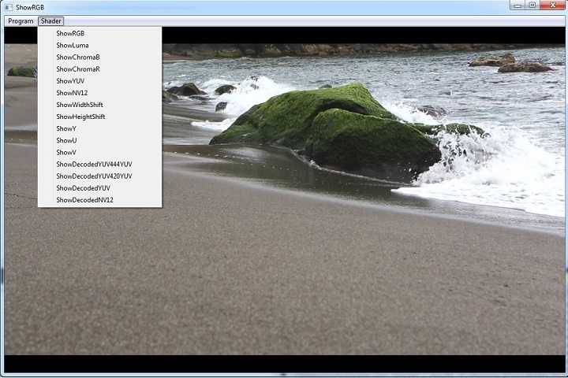
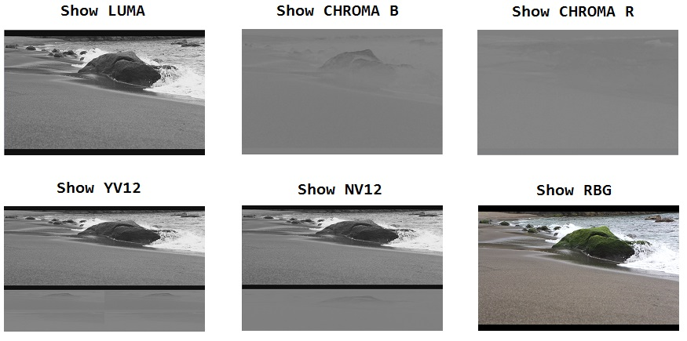
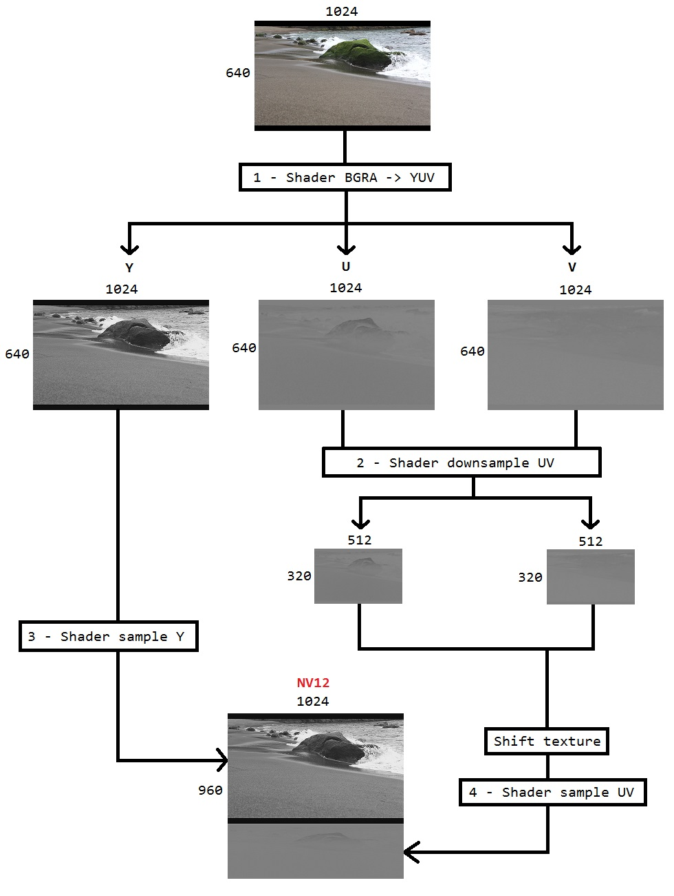

# DirectXVideoScreen

* D3D9RenderShaderYUV : ok
* D3D9VideoProcessor : ok
* D3D11ShaderNV12 : ok
* D3D11VideoProcessor : ok
* DirectXVideoScreen : not started
* SimpleDesktopDuplication : ok

## D3D9RenderShaderYUV

A DirectX9 program to convert NV12/YV12 to RGBA with shader. I use a technique that I called "Shift for YUV texture".
This technique uses one or two Texture1D, so we can use the shader directly on the NV12/YV12 texture.

## D3D9VideoProcessor

A DirectX9 program to convert BGRA texture to NV12 texture, using the video processor from the GPU.

## D3D11ShaderNV12

A DirectX11 program to convert BGRA texture to NV12 texture, using shader only.

## D3D11VideoProcessor

A DirectX11 program to convert BGRA texture to NV12 texture, using the video processor from the GPU.

## DirectXVideoScreen

Not started

## SimpleDesktopDuplication

A DirectX11 program using Desktop Duplication API. A simple screenshot is done.
